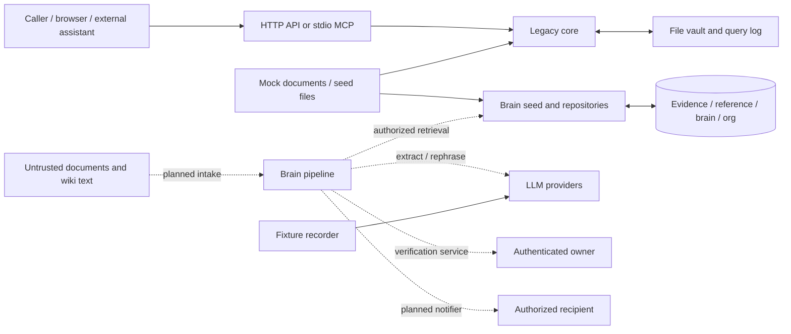

# TrustLayer / Brain threat model

## Scope and review baseline

Reviewed 2026-09-30 against commit `ffdddc0` (including the LLM-provider work that reached main during review). This is a source review, not a penetration test or an Aikido result. No application code, configuration, or tests were changed. Concrete defects and proposed regression checks are in [FINDINGS.md](FINDINGS.md).

Read together with [root instructions](../../AGENTS.md), [CLAUDE.md](../../CLAUDE.md), the [Brain specification](../brain/SPEC.md), and the integration/decision logs. `CLAUDE.md` delegates to AGENTS; the original full SPEC is `brain/brain-spec.md`.

### What actually exists

| Area | Implemented surface / limitation |
| --- | --- |
| MCP | `src/mcp/server.ts`: six tools on **stdio only**. Process-launch access is the transport boundary; there is no authenticated per-user principal. No MCP HTTP/SSE endpoint exists. |
| HTTP and UI | `src/api/server.ts`, `web/`: Express API, localhost by default, configurable HOST; React dashboard with mock user selection and polling. Production mode keeps mock identity handling. |
| Agent / intake | `src/core/assistant.ts` is a fixture-backed assistant, not an autonomous agent. `verify_sources` accepts identifiers, titles, locations and snippets; it resolves existing vault pages and does not fetch supplied URLs. Full document intake is a planned Brain pipeline. |
| Legacy knowledge store | `src/core/`: source scoring, ingestion, tasks, experts, health. Raw copies, YAML wiki pages, tasks and query logs share `vault/` across API and MCP processes. |
| Brain | `packages/brain`: domain schemas, normalization, graph repositories, SQL migrations, fixtures, separate evidence/reference indexes, Ollama/Anthropic/Fake providers, prompt builders and recorder. Pipeline, adjudication, verification service and Brain MCP registration remain placeholders. |
| Wiki ingestion | Legacy mock ingestion and Brain fixture seeding exist. There is no live wiki connector or admin ingestion API. |
| Verification / notifier | Verification-request/event tables and atomic token consumption exist. JWT issuance/verification, authenticated submission, four-eyes processing and outbound notification delivery do not exist. The present owner inbox is tasks returned to the browser. |
| Docker / CI | Optional `packages/brain/docker-compose.yml` provides loopback-bound Postgres with fixed demo credentials. No application Dockerfile or tracked CI workflow exists. Package scripts provide local checks; no CI secret gate is implemented. |

Review inventory: root instructions, README, `brain/`, `docs/`, `.mcp.json`, manifests/lockfiles and TS/lint configuration; all application/core/MCP and web source; Brain domain, repositories, migrations, LLM code/prompts, tests and fixtures; mock data, seed/record scripts and Compose. Installed dependencies, generated databases/vaults, private `.env` contents and Git history were not treated as application source. No dependency-CVE or historical-secret scan was performed.

## Assets and security objectives

| Asset | Required protection |
| --- | --- |
| HR/payroll content | Confidentiality of documents, raw snapshots, wiki sections, snippets, questions, embeddings and extracted claims. ACLs must follow derived data and prevent cross-client disclosure. Preserve integrity and provenance. Current fixtures are fictional. |
| Verdicts | Integrity of accepted facts, scores, scope, verification status, citations, attribution, canonical entries and conflicts. Reproducible versions and source hashes; no model-controlled promotion to trusted. |
| Verification tokens | Confidentiality of bearer tokens and signing keys; signature, audience/issuer, expiry, fact/person/action binding, atomic single use, revocation and reauthorization. A stored JTI alone is not authenticated proof. |
| Owner identities | Authentic directory identities, activity, principal/group membership, ownership and expertise. A string in a document, tool argument or HTTP header cannot establish identity or authority. Minimize email/directory disclosure. |
| Audit and availability | Durable attribution of reads/changes, append-only verification history, bounded storage/CPU/model costs, consistent multi-process writes and recoverable state. |
| Operational credentials | Database and provider credentials, future OIDC/JWT keys, GitHub/CI tokens. Keep outside code, logs, fixtures and tool responses. |

## Data flow and trust boundaries

Solid arrows identify existing paths (the recorder also reads the Brain demo fixtures). Dashed arrows are intended integrations, not deployed controls.

1. **Caller principal → server authority.** Treat all bodies, source IDs, `resolved_by`, `created_by`, context and mock headers as untrusted. Derive user/group identity from a trusted session or stdio launch configuration. Scope filters (country/client) describe relevance, not read permission. Check permission before retrieval, model calls, task mutation and returning derived results.
2. **Untrusted documents/wiki → trusted metadata and rules.** Document prose, YAML ownership/verification fields, URLs and claims must not establish ACLs or verified status. Connector-authenticated metadata and server audit events are separate authorities. Evidence and reference stay in separate stores; copying does not create independent corroboration or broaden visibility.
3. **LLM output → application facts.** JSON shape validation is necessary but insufficient. Check quote spans, source membership, values, scope, citations and permitted facts. Models receive no execution tools and do not decide winners or verification status. Prompt delimiters are defense in depth, not an authorization boundary.
4. **Application → persistence.** Parameter-bind values; keep SQL identifiers static/allowlisted. Separate migration/seed privileges from runtime access. Repository calls are currently privileged internal APIs, not ACL-enforcing public interfaces. File writes need cross-process coordination; verification/token/canonical/audit updates need one transaction.
5. **Application → model/network provider.** Content leaves the process when a real provider runs. Restrict provider destinations and redirects, use secure transport where remote, enforce budgets and limit/redact responses/errors. Never let document URLs become provider endpoints or unrestricted fetch targets.
6. **Application → UI, MCP output, notifier, logs and fixtures.** Recheck recipient ACLs at delivery and cache retrieval. Source text embedded in a tool result remains untrusted to a downstream agent. Escape rendered text, minimize content, never include signing secrets or bearer tokens in ordinary outputs/logs. Fixture recording persists prompts and responses and is only appropriate for synthetic data.
7. **Operators/repository/dependencies → runtime.** Seeds, migrations, prompts, model configuration and npm/Compose inputs are privileged. Demo reset must not target live data. A mutable image or compromised dependency can cross all other boundaries; CI is currently absent.

## STRIDE analysis of implemented entry points

S = spoofing; T = tampering; R = repudiation; I = information disclosure; D = denial of service; E = elevation of privilege. Each cell describes a threat, not a claim of demonstrated exploitation. F identifiers link to concrete findings. Existing controls and required controls are distinguished below.

### Every registered MCP tool

| Entry point | S | T | R | I | D | E |
| --- | --- | --- | --- | --- | --- | --- |
| `verify_sources` | Impersonate a source through conflicting ID/hash/title (F03). | Poison source association or question-derived gap metrics. | All callers recorded as `mcp`; no authenticated actor. | Source text/owners from the entire vault can enter a verdict (F02). | Repeated scoring and unbounded query logging (F06). | Caller-selected scope may be mistaken for authorization. |
| `trusted_answer` | A caller has no end-user identity. | Crafted questions manipulate the gap queue. | Query author is always `mcp`. | Search returns knowledge without ACL checks (F02). | Repeat questions to grow logs and force rescoring (F06). | An external assistant inherits access to the full vault. |
| `knowledge_health` | A caller can pose as any team's reader. | “Read-only” tool writes page statuses via lint (F07); race with resolve. | Status writes have no actor event. | Health includes questions, source titles and identities (F02/F05). | Every call reads the log and rescores unique questions (F06). | Country/team selection does not restrict caller privileges. |
| `flag_for_owner` | API analogue accepts forged creator; MCP uses generic `mcp`. | Create misleading tasks and suggested corrections. | No authenticated task creator. | Task response includes linked pages and suggested claims. | Distinct scope strings defeat task dedupe and grow storage. | Any caller can route work to owners without role/ACL checks. |
| `resolve` | Supply the assignee's ID to impersonate the owner (F01). | Publish arbitrary claim as verified; supersede sources. | Mutable task history and forged identity undermine audit (F08). | Updated page/provenance returned regardless of read permission. | Race/crash leaves inconsistent pages/tasks (F08). | Any process caller can act as an owner; no independent approval. |
| `find_expert` | Fake topic/context suggests a false business relationship. | Poisoned ownership/source metadata biases routing. | No authenticated read/audit trail. | Names, email, roles and source associations disclosed (F02). | Repeated whole-vault search/scoring. | Directory/source enumeration beyond authorized team/client. |

All six tools use Zod input validation and error wrapping. Some annotations claim read-only; they are hints, not security controls. No per-principal limiter is present on stdio.

### HTTP routes and transports

All routes below are under `/api`. Shared controls: 64 kB JSON body limit, 300 requests/minute/IP, security headers, sanitized generic internal errors, loopback default and production CSP. None supplies authenticated per-resource authorization.

| Entry point | S | T | R | I | D | E |
| --- | --- | --- | --- | --- | --- | --- |
| HTTP listener / middleware | Forged `x-mock-user`; untrusted Host/Origin (F01/F04). | Cross-origin requests can trigger bodyless reset. | No trusted principal or complete request audit. | Exposed HOST/tunnel broadens access; no TLS in this process. | Per-IP limiter bounds count, not cost/storage. | Production mode retains mock auth (F01/F02). |
| `GET /assistant` | No requester identity. | Poison fixture/source associations. | No authenticated query attribution. | Canned results or SharePoint snippets without ACL. | Repeated full-vault keyword scans. | Cross-client search access. |
| `POST /verify`, `POST /answer` | Mock caller/source impersonation. | Same source/gap poisoning as corresponding MCP tools. | Spoofable/unknown query actor. | Same unrestricted verdict content as MCP. | Persistent log growth despite request limit. | No privilege boundary between clients. |
| `GET /health` | Caller selects team/country. | Lint writes without authenticated actor. | No event for those writes. | Gap questions can disclose personal details. | Full-log rescore amplification. | Team selection is not a permission check. |
| `GET /tasks`, `POST /tasks` | Forged `created_by` on POST. | Any caller creates tasks; notes may mislead owners. | Creator cannot be trusted. | GET returns every task/note/claim. | No task-count quota or pagination. | Any caller manages the shared queue. |
| `POST /tasks/:id/resolve` | Body controls resolver identity (F01). | Unauthenticated verification and supersession. | Forged owner attribution. | Full resolved page returned. | Multi-file mutation races. | Assignee-ID knowledge is sufficient authority. |
| `GET /expert`, `GET /people` | No identity challenge. | Poisoned directory data biases output. | No read audit. | Directory and source relationships disclosed. | Repeated expert scoring. | Unrestricted directory enumeration. |
| `GET /pages`, `GET /pages/:id`, `GET /raw/:hash` | Any reachable caller accepted. | Modified local files treated as authoritative. | No principal-linked reads. | Full content, metadata, hashes and original documents (F02). | Unpaginated lists / repeated file reads. | Guessing a valid ID/hash is enough to read. |
| `POST /demo/reset` | No authenticated operator. | Deletes wiki/task/query state (F04). | Reset erases task/query history. | Raw originals remain; reset is not secure erasure. | Repeated resets / resets during writes disrupt service. | Any local caller, or permitted cross-site POST, gets destructive capability in dev mode. |
| stdio process transport | Launcher is trusted but no end-user binding. | Compromised host agent invokes mutating tools. | Generic `mcp` actor. | Tools inherit vault visibility of process. | No application tool budget. | Prompt injection in upstream content can induce privileged calls. |
| HTTP/SSE MCP transport | **Absent.** Future session/token impersonation. | Future session fixation, message replay. | Future session messages need actor/request IDs. | Future stream/session hijack leaks results. | Future long-lived stream exhaustion. | Future auth/Origin gaps expose all tools remotely. |

### Intake, persistence, output and operational entry points

| Entry point | S | T | R | I | D | E |
| --- | --- | --- | --- | --- | --- | --- |
| Agent document intake (`InputSource`; full payload planned) | Forged stable ID/title/hash (F03). | Hostile snippets/instructions; forged future metadata. | Need source hash and fetch provenance. | Unauthorized IDs resolve to vault data. | Future large documents/decompression/fetch loops. | Never accept caller-supplied ACL/owner/verification as authoritative. |
| Legacy ingestion / wiki frontmatter | Imported owner and verification dates can be forged (F09). | YAML fields/claims become trust inputs without full schema. | Raw hash proves bytes, not author/approval. | Source copies may expose private messages/PII. | Malformed input can fail after destructive reset. | Untrusted metadata promotes a source's authority. |
| Brain wiki/evidence fixture seed | Fixture principals and owners become directory authority. | Upserts overwrite existing IDs in selected database (F12). | No immutable seed-change audit. | Source texts/ACLs persist in DB. | Wrong DATABASE_URL can affect live state. | Seed/migrations execute with schema-changing privileges. |
| Brain repositories / vector search | Supplied principals need trusted origin. | Upserts can reopen consumed tokens (F10); weak source linkage (F13). | Event trigger misses TRUNCATE (F11). | Direct getters/searches lack mandatory ACL (F14). | Broad searches and unbounded limits at internal interface. | Unsafe adapters can bypass the visible-to listing helpers. |
| LLM output / model HTTP response | Model can fabricate source or fact IDs. | Hallucinated quotes/values (F15), unsupported composed answer (F16). | Cache/model/prompt versions must identify decisions. | Provider errors can echo secrets/content (F17). | Unbounded response reads, retries, model budget exhaustion. | Schema-valid model text must not become verified authority. |
| MCP text / browser owner inbox | Malicious titles/claims can impersonate instructions. | Misleading task text or downstream prompt injection. | UI mock owner is not evidence of approval. | Entire task/identity list shown (F02). | Unbounded task results/polling work. | Downstream agent may treat source text as permission to resolve. |
| Notifier output | **Absent.** Future forged sender/recipient. | Future HTML/Markdown/link injection and modified verdict delivery. | Need immutable delivery/recipient record. | Wrong recipient, stale ACL, token-bearing link forwarded/logged. | Retry storms or mail/chat flooding. | Notifications must not authorize a verification by themselves. |
| Seed/reset/record CLIs and migrations | Trust operator and file provenance, not display names. | Reset/upsert can replace data; migration SQL runs directly. | Record applied migration/prompt hashes and operator. | Recorder writes full prompts/responses to committable fixtures. | Large fixtures, database locks, provider costs. | Compromised script runs with filesystem/DB/provider credentials. |
| Docker / npm / prospective CI | Image/package substitution; stolen future CI identity. | Mutable image/dependency/lifecycle script changes. | Need pinned artifacts and build provenance. | Fixed demo DB password; future CI logs/artifacts may leak credentials. | Resource exhaustion / unavailable dependency registry. | Runtime sharing migration-owner DB privileges increases blast radius. |

## Planned Brain MCP tools (not registered)

These seven names come from SPEC §12. They are modeled separately so missing implementations are not mistaken for existing protections or live vulnerabilities.

| Planned entry point | S | T | R | I | D | E |
| --- | --- | --- | --- | --- | --- | --- |
| `brain_analyze_case` | Forged caller/document metadata. | Injected claims, false scope, copied evidence. | Missing immutable run/source provenance. | Unauthorized documents sent to a model or included in verdict. | Large payloads and extraction/enrichment fan-out. | Caller-provided ACL or verification metadata becomes authority. |
| `brain_get_verdict` | Another user's run ID. | Stale or poisoned verdict cache. | No actor-linked read event. | Derived facts leak after source access is revoked. | Repeated expensive retrieval/recomposition. | Missing run/source authorization. |
| `brain_explain_fact` | Forged fact/run association. | Misleading graph links or citations. | Unversioned explanation cannot be traced. | Graph traversal reveals restricted neighbors. | Unbounded traversal. | Fact access incorrectly grants all connected-source access. |
| `brain_list_verifications` | Another person's ID. | Manipulated queue/filter state. | Missing read attribution. | Tokens or restricted fact details in a list. | Unpaginated queues. | Caller chooses whose inbox to read. |
| `brain_submit_verification` | Stolen/forged bearer token or identity. | Changed fact/action/payload, token replay. | Missing atomic append-only event. | Reply reveals sources verifier cannot read. | Replays and recomputation storms. | Missing current can-verify/ACL/four-eyes checks. |
| `brain_health` | Claimed domain/team access. | Poisoned metrics or events. | Unattributed metric mutations. | Aggregate drilldowns expose restricted facts/people. | Full graph rescoring. | Optional filters mistaken for authorization. |
| `brain_ingest_reference` | Fake administrator/connector. | Forged official status, owner, ACL, links or wiki content. | Missing authenticated ingestion provenance. | Broadening ACLs or fetching internal URLs. | Large batches/link loops. | Non-admin writes or reference text promoted to verified evidence. |

## Controls to preserve and implementation gates

Existing useful controls: strict API schemas/length limits, validated filesystem IDs/hashes, React text escaping, separate evidence/reference SQL schemas and vector indexes, parameter-bound SQL values, tested visible-to listing helpers, an atomic expiring `burnToken`, snapshot insert-or-ignore, verification-event UPDATE/DELETE trigger, JSON model validation/retry/cache and sanitized prompt delimiters. None substitutes for authenticated ACL enforcement.

Before using non-fictional data or adding remote transport: bind principals on the server; enforce source and derived-result ACLs; make verification reauthorize fact/person/action, retain single use and four-eyes checks; isolate mock reset/seed; transact mutations; cap ingestion/log/model work; enforce semantic LLM checks and recipient-aware delivery. For future SSE, authenticate every request and bind stream/session IDs to that principal, validate Origin/Host, require secure transport, and impose connection/idle limits. For future URL ingestion, restrict schemes/destinations/redirects and prevent internal-network fetching.

Every remediation must include a regression test that fails against the relevant defect without weakening auth, validation or ACLs. For this documentation-only task, these are plans, not implemented changes. Missing agent, notifier, SSE and CI components are review gaps/design gates, not invented live vulnerabilities.
